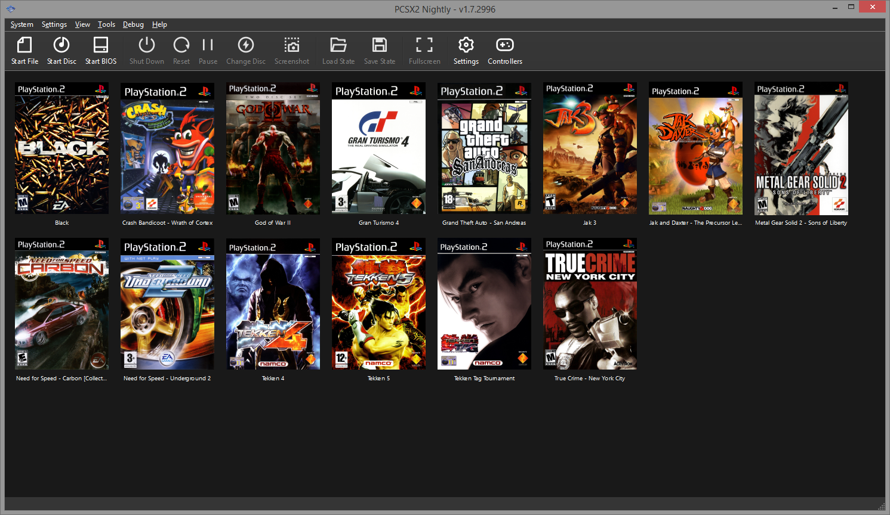

# PCSX2-Qt for Windows 8.1


This repository contains a fork of the leading PlayStation 2 emulator [PCSX2](https://github.com/PCSX2/pcsx2), modified to be compatible with Windows 8.1 (as upstream is Windows 10 or newer exclusive now, on Qt). For hardware requirements, setup guides and other basic know-how, see the official [PCSX2 usage guide.](https://pcsx2.net/guides/basic-setup/)

## Scope of support

Since I'm not an emulator developer myself, my ability to keep up-to-date with upstream may be limited. For now, rebasing is quite simple, and I do so weekly / bi-weekly. Over time this may change however, and when that happens, I'll modify this repository to reflect that.

It must also be noted that since this is a fork, it's **an unnofficial version** of the emulator, and thus if you visit the project's Discord, or any other community space, they may refuse support. I asked for people to be redirected to my DMs when that happens, but best keep this in mind. If you experience any issues with the emulator, and you have a Windows 10 or newer capable machine lying around, please reproduce your issue there, and save the support staff (and yourself) some time.

Finally, I've been asked by a developer on the project to not publicly distribute builds of this fork, so as to minimize fragmentation and avoid support overhead. While these are hardly ironclad rationales in this specific case, I've decided to comply, so that means no binary releases are published at the repository's GitHub Releases section. I apologize for the inconvenience this may cause.

## Caveats and usage

As stated above, this is a downstream fork with a host system compatibility extension aim, and it's limited in distribution. For this reason, both its caveats and usage differs from the regular PCSX2 that you know.

### Known defects and caveats

- The inbuilt auto-updater relies on their self-hosted REST API for retrieving the updates, so obviously that won't work here. ~~For this and other reasons not relevant here, I recommend using my [PCSX2 Background Updater](https://github.com/dio-gh/pcsx2-bg-updater) script instead, if you wish to have automatic updates tracking this fork.~~ (The PCSX2 Background Updater is temporarily not functional.)
- Font rendering is somewhat broken (see the screenshot below). This is theoretically fixable, but unfortunately the PCSX2 Qt GUI doesn't respond to the fix as expected, and remains only partially fixed. I haven't spared the time to figure the issue out, so I left it as is for now. The breakage doesn't significantly impact the usability of the emulator, though.
- There was a [memory mapping related fix](https://github.com/PCSX2/pcsx2/pull/6533) upstream that's not possible to include here, as it depends on post-Win8.1 functionality. The fix resolves a possible crash scenario when initializing the software renderers; seeing this has been there for years (and have never manifested for me), I don't find this tremendously important, but it's good to know.

Also important that only the bare minimum amount of changes have been introduced here, the ones necessary for Windows 8.1 compatibility. No other modifications are present, nor are planned to be added.

### Usage and building

As public builds are not available, you have two ways to get this fork going.

#### CI builds:

These are builds produced by the continuous integration system (GitHub Actions). You need to have a GitHub account to retreive them. To do so, log in, then:

- click on the `Actions` tab
- select the upmost `qt-revert` build that has the words `Windows Builds` visible in the same row
- on the next page in the `Artifacts` section, grab the AVX2 Qt build (the one without symbols).

Extract and setup as normal. On the off chance your machine is really old or has a cheap CPU, you may need to use the SSE4 build instead, just like with the official PCSX2 releases.

#### Self-builds:

Building PCSX2 yourself is fairly straightforward. On Windows 8.1, you'll need [Visual Studio 2019](https://visualstudio.microsoft.com/vs/older-downloads/) (as 2022 is Windows 10 and above only), with the `Desktop development with C++` workload components installed. After that, you'll need to issue the following [git command](https://www.youtube.com/watch?v=rrHsdQdC91I) inside a directory where you wish to put PCSX2 in:

```
git clone --shallow-submodules --recurse-submodules --jobs=$(nproc) https://github.com/dio-gh/pcsx2.git
```

Once it has completed, you'll need to download [this archive](https://github.com/PCSX2/pcsx2-windows-dependencies/releases/download/2022-01-20/qt-6.2.2-x64-tools.7z) containing a stripped down and precompiled version of Qt v6.2.2, and extract it to `3rdparty/qt`.

After that, all that remains is to open `PCSX2_qt.sln`, select `Release AVX2` and `x64` as the build type, and hit the big green button. Note that selecting any other build type will likely result in a compiler crash, as it runs out of memory relatively easily (MSVC in VS2019 is 32-bit).

The resulting program will be put into `/bin`, and will automatically start up once the compilation finishes. You may want to copy it out elsewhere afterwards. I also strongly recommend closing PCSX2 after it successfully compiles for the first time, and launching the app from outside Visual Studio instead, so as to not get tripped up on fastmem exceptions with the debugger (needlessly) attached (i.e. on crap you don't know about).

## Screenshot



## Final words

I don't take any support tickets or pull requests. I maintain no dedicated community space for discussions around this fork either. If you need me, you can find me on the official PCSX2 Discord.
